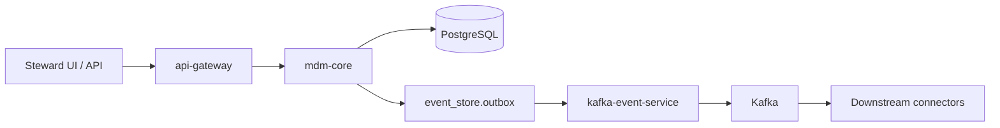

# Azile AI MDM — Architecture (Phase 0)

## Hub-and-spoke entity lifecycle

1. **Author in MDM** — `POST /entities` with `record_origin: mdm_authoritative`.
2. **Persist** — `core_mdm.entities` + attributes in a transaction.
3. **Emit** — `EntityCreated` outbox event (topic `mdm.entity.events`).
4. **Distribute** — optional `EntityDistributionRequested` (topic `mdm.entity.distribution`) when `distribute: true`.
5. **Consume** — connector workers publish to Salesforce, SAP, webhooks, etc. (Phase 1+).

Ingested entities use `record_origin: ingested` and the same pipeline in reverse for matching before golden record promotion.

## Service map

| Service | Port | Responsibility |
|---------|------|----------------|
| api-gateway | 8080 | Auth, tenant headers, proxy to core/AI |
| mdm-core | 8081 | Entities, match, merge, outbox writes |
| ai-service | 8082 | MCP copilot (Phase 1 enrichment) |
| kafka-event-service | — | Outbox → Kafka |

## Security (development)

- `AUTH_DISABLED=true` — bypass bearer check (local only).
- `API_BEARER_TOKEN=<secret>` — required when auth enabled.
- `x-tenant-id` — required on protected routes.

## OpenAPI

See [openapi.yaml](./openapi.yaml).
